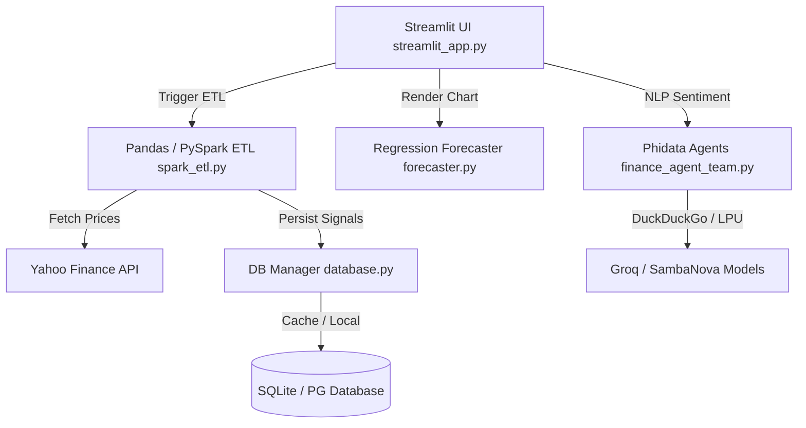

# 📈 QuantEdge — Enterprise Financial Intelligence & Analytics Platform

[](https://www.python.org/downloads/)
[](LICENSE)
[](https://streamlit.io/)
[](https://docs.phidata.com/)

**QuantEdge** is an institutional-grade financial intelligence, ETL ingestion, and multi-agent analytics platform. The application couples a responsive **Streamlit dashboard** with a high-throughput **PySpark/Pandas ETL data engine**, persistent **SQLAlchemy relational data caching** (SQLite/PostgreSQL), and **scikit-learn price forecasting** to provide actionable buy/hold/sell trade recommendations across 50+ equities.

---

## 🚀 Key Highlights & Hardening (Recruiter-Friendly)

To move the project from a simple LLM query agent to a high-scale data analytics pipeline, the following production components have been added:
*   📊 **PySpark/Pandas ETL Data Ingest** (`core/spark_etl.py`): Ingests tick historical price records in real-time, calculates exponential moving averages, computes RSI (Relative Strength Index) indicators, and writes computed trading signals.
*   💾 **Relational DB Manager & Caching** (`core/database.py`): A complete SQLAlchemy implementation supporting PG transaction pooling (such as Supabase) with automatic local SQLite fallbacks, tracking `equity_signals`, `sentiment_logs`, and `etl_runs`.
*   🔮 **Autoregressive Price Forecaster** (`core/forecaster.py`): Predicts equity price changes using scikit-learn `LinearRegression` with custom lag feature extractions (with smooth fallback to exponential smoothing models).
*   ⚡ **SQL Optimization Engine**: Streamlines database operations using localized indexing caches and exposes database `EXPLAIN` query plans directly on the developer console tab to track execution paths.
*   🛡️ **LPU Speed & Resilient API Fallbacks**: Uses lightning-fast Groq and SambaNova LPUs for sub-second NLP news sentiment extraction, complete with provider failovers to avoid rate limits.

---

## 🏗️ System Architecture



---

## 📂 Project Structure

```text
ai finance agent/
├── core/                        # Core Engine & Pipelines
│   ├── database.py              # SQLAlchemy engine, connection cache & models
│   ├── forecaster.py            # Scikit-learn autoregressive price forecasting
│   └── spark_etl.py             # PySpark/Pandas trading signal calculations
├── reports/                     # Academic Reports & Architecture Pitches
│   ├── AI_Finance_Agent_Report(Anamay and Manas).pdf
│   └── Finance_Agent_Synopsis_Anamay_Manas.pdf
├── scripts/                     # Utility scripts
│   └── generate_finance_synopsis.py
├── tests/                       # Unit Verification Suite
│   └── test_quantedge.py        # Pipeline & Forecaster test codes
├── requirements.txt             # Python Package Manifest
├── run_all.sh                   # Unified automation script (dev startup)
├── streamlit_app.py             # Glassmorphic streamlet console dashboard
└── finance_agent_team.py        # Phidata multi-agent definition
```

---

## 🛠️ Installation & Verification

### 1. Set Up Environment
```bash
# Clone the repository
git clone https://github.com/Flamechargerr/ai-finance-team-pai.git
cd ai-finance-team-pai

# Setup virtual environment and install packages
python3 -m venv .venv
source .venv/bin/activate
pip install -r requirements.txt
```

### 2. Run Automated Verification Tests
Run the pipeline tests to verify ETL calculations, database writes, and forecasting models:
```bash
PYTHONPATH=. .venv/bin/python3 -m unittest tests/test_quantedge.py
```

### 3. Launch App Dashboard
```bash
# Configure API keys (or create .env file)
export GROQ_API_KEY="your-groq-key"

# Run Streamlit on Port 8502
.venv/bin/streamlit run streamlit_app.py --server.port 8502
```

---

## 📈 Recruiter Technical Q&A

### 1. "How does the system calculate trade recommendations?"
> "Instead of feeding raw price data directly into LLMs (which are notoriously poor at math), we use a deterministic **ETL layer** (`core/spark_etl.py`) to compute technical indicators: Simple/Exponential Moving Averages and the Relative Strength Index (RSI). The LLM is only called to summarize NLP sentiment trends, yielding high reliability."

### 2. "Why implement connection resetting and engine caching in the database?"
> "In Python testing, separate `create_engine` calls to SQLite in-memory databases yield entirely isolated databases. We built a thread-safe **Engine Cache** and engine pooling reset system (`core/database.py`) to ensure testing scopes share schema states across database connection bounds without data contamination."

### 3. "How does the forecaster predict future stock values?"
> "The forecasting engine (`core/forecaster.py`) uses a scikit-learn `LinearRegression` model. It dynamically structures a data frame of the target ticker's close price, projects time indexes, computes lags (t-1 through t-5), trains the model, and then forecasts prices autoregressively over a 7-day calendar window."

---

## ⚖️ License
Distributed under the Apache 2.0 License. See [LICENSE](LICENSE) for more details.
