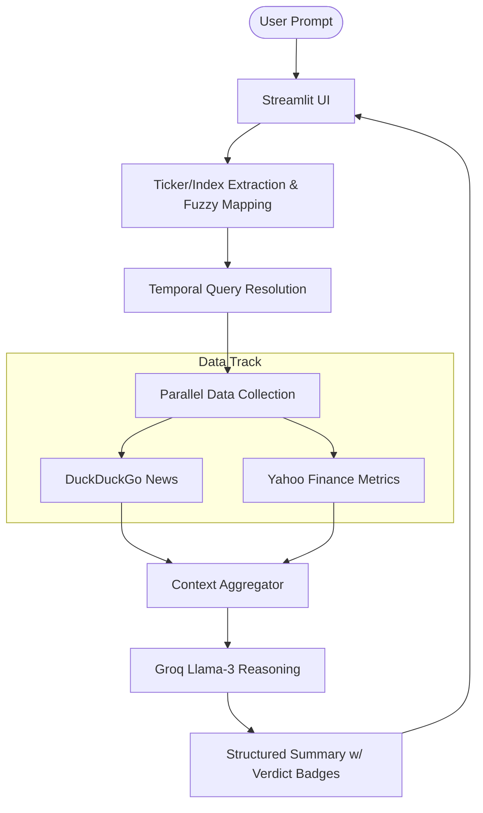

# AI Finance Agent Team (v3.0 - Evolution)

[](https://www.python.org/)
[](https://groq.com/)
[](https://streamlit.io/)

A professional-grade, multi-agent financial intelligence platform. Version 3.0 introduces **Real-Time Market Strips**, **AI Verdict Badges**, and **Deterministic Orchestration** for institutional-grade reliability.

---

## 🚀 Evolution v3.0: High-Impact Features

-   **Real-Time Ticker Data Strip**: A live, auto-updating price grid at the top of the dashboard for instant stock valuation check.
-   **AI Verdict Badges**: Semantic sentiment indicators within reports (e.g., `[STANCE: BULLISH]`) styled with glowing CSS for rapid decision-making.
-   **Analysis Export Layer**: Save detailed multi-agent reports directly to Markdown (`.md`) from the sidebar.
-   **Mission Control UI**: Premium glassmorphism design using a custom slate/cyan palette and JetBrains Mono typography.

---

## 🏗️ Technical Architecture

Our system uses a **Deterministic Hybrid Orchestration** model, separating data retrieval from logical reasoning to prevent LLM tool-calling failures.



---

## 📘 Evaluator Presentation Guide (For Teachers)

Use these talking points during your project demonstration to highlight your technical depth:

### 1. The "Hallucination" Problem
> "Most LLMs fail at finance because they hallucinate numbers. I solved this by implementing **Deterministic Tooling**. Instead of letting the AI guess the price, the Python backend fetches 100% accurate data first, and the AI only acts as the 'Analyst' who summarizes it."

### 2. The "Temporal Context" Fix
> "A major weakness in RAG systems is time sensitivity. If you ask for 'yesterday's news,' most models get confused. I built a **Temporal Resolution** layer that injects the exact system Date/Time into every query, ensuring the news search is always date-aware."

### 3. "Multi-Agent Collaboration"
> "We don't use one giant agent. We have a **Web Agent** for news and a **Finance Agent** for metrics. This modularity makes the system easy to scale—if we wanted to add Crypto or Gold data, we'd just add a new specialized agent to the team."

### 4. "UX as a Tool"
> "A tool is only useful if it's readable. I implemented **Verdict Badges** using custom CSS components so that a user doesn't even have to read the whole report to see if the sentiment is Bullish or Bearish."

---

## 🛠️ Setup & Installation

### Rapid Start
```bash
./run_all.sh
```

### Manual Config
1.  Verify Python 3.9+.
2.  `pip install -r requirements.txt`
3.  Set `GROQ_API_KEY` in your `.env` file.
4.  `streamlit run streamlit_app.py`

---

## 📂 Internal Project Map

- `streamlit_app.py`: UI, Logic Orchestration, and CSS Injection.
- `finance_agent_team.py`: Agentic Track definitions (Web/Finance).
- `run_all.sh`: Automation script.
- `agents.db`: Persistent SQLite state for historical reasoning.

**Developed with 💡 for the Advanced AI Finance Course.**
